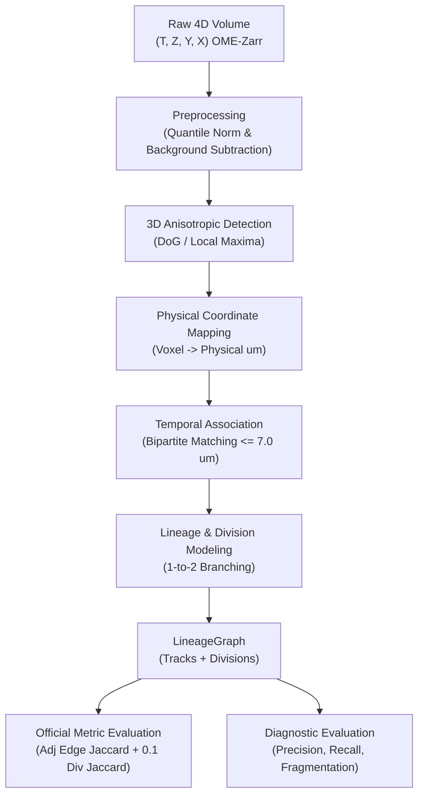

# PROJECT PLAN: 3D+TIME CELL TRACKING AND LINEAGE RECONSTRUCTION

## 1. Project Overview & Motivation

In developmental biology, understanding how a single fertilised egg transforms into a complex multicellular organism requires tracking individual cells across 3D space and time. High-throughput light-sheet fluorescence microscopy enables non-invasive imaging of developing zebrafish (*Danio rerio*) embryos at high temporal resolution.

However, automated 3D cell tracking in live embryo imaging is hampered by:
1. **Severe Optical Anisotropy**: The axial resolution ($Z$) is typically much lower than lateral ($XY$) resolution ($1.625\,\mu\text{m}$ vs $0.40625\,\mu\text{m}$, a $4:1$ ratio).
2. **Dense, Deforming Cell Populations**: Cells pack tightly and undergo collective tissue flows and sudden mitotic divisions.
3. **Sparse and Incomplete Annotations**: In developmental biology benchmarks, only subsets of cells are manually verified.
4. **Computational Burden**: Volumetric time-lapse data scales to hundreds of gigabytes, making naive processing intractable.

### Research Question
> **"How much can physically informed cell detection and temporal association improve 3D cell tracking and lineage reconstruction in developing zebrafish microscopy?"**

---

## 2. Theoretical Framework & Principles

### 2.1 Anisotropic Metric Space
Microscopy voxels are cuboids, not cubes. A displacement vector $\Delta \mathbf{v} = (\Delta z, \Delta y, \Delta x)$ in voxel units corresponds to a physical displacement vector $\Delta \mathbf{p} = (s_z \Delta z, s_y \Delta y, s_x \Delta x)$ in physical units ($\mu\text{m}$), where $\mathbf{s} = (1.625, 0.40625, 0.40625)$.

The true physical distance is:
$$d_{\text{phys}}(\mathbf{v}_1, \mathbf{v}_2) = \|\mathbf{s} \odot (\mathbf{v}_1 - \mathbf{v}_2)\|_2 = \sqrt{s_z^2 (z_1 - z_2)^2 + s_y^2 (y_1 - y_2)^2 + s_x^2 (x_1 - x_2)^2}$$

Naive Euclidean voxel distance:
$$d_{\text{voxel}}(\mathbf{v}_1, \mathbf{v}_2) = \sqrt{(z_1 - z_2)^2 + (y_1 - y_2)^2 + (x_1 - x_2)^2}$$
underestimates axial displacement by a factor of 4! This causes nearest-neighbor trackers in voxel space to falsely associate cells across distant focal planes while missing genuine lateral migrations.

### 2.2 Anisotropic Blob Detection
Cell nuclei in zebrafish are approximately spherical in physical space ($R \approx 3\,\mu\text{m}$). In voxel space, they appear as flattened ellipsoids with axial extent $\sigma_z = R / s_z \approx 1.85$ voxels and lateral extent $\sigma_{xy} = R / s_{xy} \approx 7.4$ voxels. 
Any filter kernel (e.g. Gaussian smoothing or Difference-of-Gaussians) must employ anisotropic standard deviations:
$$\boldsymbol{\sigma}_{\text{voxel}} = \left(\frac{\sigma_0}{s_z}, \frac{\sigma_0}{s_y}, \frac{\sigma_0}{s_x}\right)$$

---

## 3. System Architecture & Pipeline

---

## 4. Staged Experimental Protocol

### Baseline A: Classical Detection + Physical Nearest-Neighbor Tracking
- **Detection**: 3D Difference-of-Gaussians with anisotropic $\boldsymbol{\sigma} = (1.85, 7.4, 7.4)$ and 3D local maxima suppression.
- **Tracking**: Greedy / Bipartite nearest-neighbor matching on $d_{\text{phys}}$ with max distance cutoff $7.0\,\mu\text{m}$.
- **Lineage**: Linear tracks (no division branching).

### Experiment B: Voxel Distance vs Anisotropic Physical Distance
- **Hypothesis**: Replacing naive voxel Euclidean distance with true physical distance will reduce false axial associations and significantly increase Edge Jaccard.
- **Protocol**: Hold detection constant; run tracker using $d_{\text{voxel}}$ vs $d_{\text{phys}}$. Measure $\Delta \text{Edge Jaccard}$ and axial identity switches.

### Experiment C: Detection Robustness & Node Penalty Trade-off
- **Hypothesis**: The competition metric penalises excess predicted nodes through $T_{\text{true}}$. Tuning detection thresholds to match $T_{\text{pred}} \approx T_{\text{true}}$ will maximize the adjusted edge Jaccard by minimizing penalty scaling.
- **Protocol**: Sweep detection intensity percentiles and measure raw Jaccard vs adjusted Jaccard.

### Experiment D: Motion-Aware Temporal Association
- **Hypothesis**: Embryo cells exhibit coherent convective drift and momentum. Incorporating a constant-velocity Kalman filter or nearest-neighbor with motion extrapolation will outperform static nearest-neighbor.
- **Protocol**: Compare static physical distance cost $C_{ij} = d_{\text{phys}}(c_{t, i}, c_{t+1, j})$ against motion-projected cost $C_{ij} = d_{\text{phys}}(c_{t, i} + \mathbf{v}_i \Delta t, c_{t+1, j})$.

### Experiment E: Division Detection & Branching
- **Hypothesis**: Detecting mitotic cell shape elongation (anaphase/telophase) and daughter pair symmetry enables reconstruction of division forks, improving the combined competition score.
- **Protocol**: Evaluate Division Jaccard and overall score with candidate daughter pair bifurcation.

---

## 5. Evaluation Protocol

### 5.1 Primary Metric (Official Competition Criterion)
$$\text{Score} = \text{Adjusted Edge Jaccard} + 0.1 \times \text{Division Jaccard}$$
Evaluated via micro-averaging across test/validation sequences using Hungarian bipartite assignment with $7.0\,\mu\text{m}$ cutoff.

### 5.2 Diagnostic Metrics
1. **Centroid Detection Recall**: Fraction of GT cell centers matched within $7.0\,\mu\text{m}$.
2. **Centroid Detection Precision**: Fraction of predicted centers matching GT (adjusted for sparse sampling).
3. **Identity Switches**: Frequency of tracks changing biological identity across consecutive timepoints.
4. **Track Fragmentation**: Ratio of total track segments to true continuous lineages.
5. **Computational Throughput**: Execution time per 3D timepoint and peak memory consumption.

---

## 6. Milestones & Roadmap

- [x] **Phase 0**: Verification of official competition specifications, schemas, and metrics.
- [x] **Phase 1**: Hardware and environment audit.
- [ ] **Milestone 1**: 
  - Complete environment and test suite.
  - Implement coordinate conversion module (`src/coordinates/transforms.py`).
  - Implement data loading and inspection module (`src/data/loader.py`).
  - Download real sample sequence `t101` and verify 3D volume + GT track visualization.
- [ ] **Milestone 2**:
  - Implement 3D Anisotropic DoG cell detector (`src/detection/classical_dog.py`).
  - Verify detection precision/recall against ground truth annotations on `t101`.
- [ ] **Milestone 3**:
  - Implement modular temporal association (`src/tracking/nearest_neighbor.py`).
  - Implement official metric evaluator (`src/evaluation/official_metric.py`).
  - Run Baseline A end-to-end and report quantitative scores.
- [ ] **Milestone 4**:
  - Execute controlled Experiments B, C, D, E.
  - Produce ablation tables, track visualizations, and final technical report.
