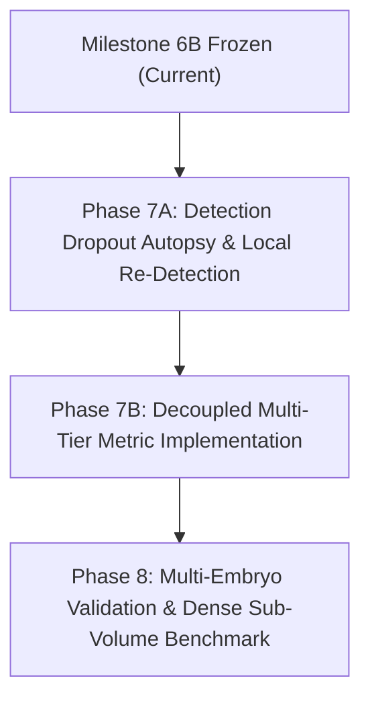

# Strategic Research Direction: Beyond Milestone 6B

**Date**: 2026-09-27  
**Status**: Proposal and Roadmap (Pre-Implementation Planning)  
**Context**: Milestone 6B Completion on Biohub 3D Zebrafish Cell Tracking (`t101`)  
**Target Document**: `results/next_phase/RESEARCH_DIRECTION.md`  

---

## 1. Context and Problem Formulation

Milestones 1 through 6B systematically explored the algorithmic frontier of 3D cell detection and temporal association on the light-sheet microscopy sequence `data/samples/t101` (20 temporal volumes, $\sim 100$ cells per volume):
- **Milestones 1–3**: Established anisotropic coordinate transforms, DoG detection, and nearest-neighbor baseline tracking ($J_{\text{adj}} \approx 0.0755$ on holdout).
- **Milestones 4–5**: Introduced sub-voxel quadratic refinement, multi-modal feature engineering, and Random Forest learned affinity with selective rejection ($J_{\text{adj}} = 0.1383$ on continuous 0–19).
- **Milestones 6A–6B**: Implemented causal velocity-adaptive gating and multi-frame track reconnection ($k \le 2$).

### The Core Empirical Finding:
Despite generating hundreds of valid-looking background linkages (nearly doubling continuous tracks of length $\ge 4$ from 24.2% to 45.6%), **multi-frame track reconnection recovered zero (0) missing annotated true positives** on the holdout benchmark. Furthermore:
1. **45.7% (16/35) of holdout ground-truth edges cannot be tracked by any association method** because at least one endpoint is completely missing from the frozen D2+R1 detections.
2. **Prolonged detection dropouts ($\ge 3$ consecutive frames)** completely break causal track persistence in 2 out of 6 annotated lineages (e.g., Lineage 4 missing for 8 consecutive frames; Lineage 2 missing for 3 consecutive frames).
3. **The sparse evaluation metric exclusively rewards directed $\Delta t = 1$ edges** and penalizes $\Delta t > 1$ gap connections touching annotated cells as annotation-relative False Positives.

These results indicate that **heuristic tuning of association trackers on sequence `t101` has reached empirical saturation**. To make genuine progress, the project must shift its focus.

---

## 2. Evaluation of Four Potential Research Directions

We evaluate four candidate directions using the quantitative evidence accumulated across Milestones 1–6B.

```
+---------------------------------------------------------------------------------------------------+
|                                 CANDIDATE RESEARCH DIRECTIONS                                     |
+------------------------------------+--------------------------------------------------------------+
| 1. Detection-Focused Investigation  | Diagnostic autopsy of why annotated endpoints are missed    |
| 2. Annotation Coverage Expansion   | Dense lineage annotation to eliminate sparse metric artifacts|
| 3. Multi-Component Evaluation      | Decoupled benchmarks for detection, link, gap, and continuity|
| 4. Cross-Embryo Dataset Acquisition| Multi-embryo light-sheet data to test biological generality  |
+------------------------------------+--------------------------------------------------------------+
```

---

### Direction 1: Detection-Focused Work (Diagnostic Autopsy of Missing Endpoints)

#### Rationale & Evidence:
In Extended Holdout (frames 10–19), 16 of the 31 false negative edges (51.6% of all missed edges, 45.7% of all ground-truth edges) are directly caused by detection absence in D2+R1. If a cell centroid does not exist as a node in the graph, no tracking algorithm—regardless of its affinity model, gap window, or optimization solver—can possibly form the correct edge.

#### Investigation Questions:
- Why do annotated cells disappear from D2+R1?
  - **Local Contrast / Low Intensity**: Do cells experience photobleaching, fluorophore blinking, or laser scattering at deeper $z$-planes?
  - **DoG Scale Mismatch**: Does cell morphological expansion, flattening during mitosis, or nuclear elongation cause the DoG filter radius ($\sigma_{\text{spatial}} = 2.0$, $\sigma_{\text{axial}} = 1.0$) to produce sub-threshold responses?
  - **Non-Maximum Suppression (NMS) Suppression**: Are missing cells being suppressed by brighter neighboring cells within the 3.0 µm exclusion radius?
  - **Boundary Effects**: Do missing endpoints reside near volume boundaries where padding or edge truncation reduces DoG response?
  - **Temporal Disappearance Patterns**: Does detection failure correlate with specific developmental phases (e.g., cell division, fast migration bursts)?

#### Proposed Experiments:
1. **Endpoint Intensity & Filter Profiling**:
   Extract 3D raw intensity, local signal-to-noise ratio (SNR), and raw DoG response volumes centered on the ground-truth coordinates of the 16 missed detection endpoints. Compare these distributions against detected true positive centroids.
2. **Counterfactual Threshold Sensitivity**:
   Run D2 detection at lower response thresholds (e.g., lowering `min_intensity_percentile` from 98.0 to 95.0, 90.0, 85.0) exclusively in the spatio-temporal bounding cylinders around missed ground-truth trajectories to quantify whether the physical signal exists below the current global cutoff.
3. **Temporal Evidence Pooling (Non-Causal / Bidirectional Guidance)**:
   Test whether backward-in-time or bidirectional temporal evidence (e.g., using detections at $t-1$ and $t+1$ to guide localized re-detection at $t$) can recover missing centroids without flooding the volume with spurious background nodes.

#### Required Data:
- Frozen raw 3D microscopy volumes (`data/samples/t101/raw/`, frames 0–19).
- Ground-truth node coordinates and lineage annotations.
- Intermediate voxel arrays from D2 DoG filtering.

#### Target Metrics:
- **Detection Recall on Ground-Truth Nodes**: Baseline is $\approx 70.4\%$ on frames 10–19. Target: $\ge 85.0\%$.
- **Precision Penalty**: False discovery rate of newly admitted detections (quantified by soft node penalty factor $\min(1.0, T_{\text{true}} / N_{\text{pred\_nodes}})$).

#### Risks & Trade-offs:
- *Risk*: Lowering detection thresholds globally dramatically increases candidate node density, which may exacerbate the #1 cause of track fragmentation: **assignment conflicts** (which already caused 51.7% of track terminations in 6B).

---

### Direction 2: Annotation Coverage Expansion (Dense Lineage Ground Truth)

#### Rationale & Evidence:
The current benchmark on `t101` evaluates against only **6 annotated cell lineages** in an embryo containing $\sim 100$ cells per volume ($\approx 6\%$ coverage). Under such sparse supervision:
- Over 90% of all predicted edges connect real, unannotated cells.
- The official evaluator assumes unannotated predictions are "neutral" (not penalized), but if an algorithmically correct gap edge or wide-gate edge touches an annotated cell that has a missing detection, it is counted as a **False Positive**.
- Tracking algorithms that maintain high graph continuity (such as Method E, which formed 1,135 gap edges and doubled long tracks) are penalized or unrewarded, while trivial low-recall trackers can achieve deceptively high precision.

#### Investigation Questions:
- What density of annotation is required to reliably distinguish between:
  (a) True tracking errors (swapping identities between two real cells).
  (b) Benign background associations (linking unannotated cells).
  (c) Annotation-relative artifacts (linking an annotated cell across a true biological dropout)?
- Does dense local annotation in a sub-volume provide better statistical power than sparse whole-embryo tracking?

#### Proposed Experiments:
1. **Synthetic Full-Annotation Simulation**:
   Using a realistic synthetic 3D cell simulation (or high-confidence consensus tracking on a sub-volume), simulate the official metric under varying annotation sampling fractions (from 5% to 100% of all cells). Characterize how Adjusted Edge Jaccard scales with annotation density.
2. **Dense Sub-Volume Proof-of-Concept**:
   Select a localized $100 \times 100 \times 30\,\mu\text{m}^3$ region of `t101` spanning frames 10–19, and densely annotate all cell centroids and lineage transitions within that sub-volume. Re-evaluate Methods A–F.

#### Required Data:
- Manual expert annotation or validated semi-automated segmentations for a dense sub-region of `t101`.
- Simulated 3D cell datasets with known ground-truth topologies.

#### Target Metrics:
- Statistical variance of Edge Jaccard as a function of annotation density.
- Fraction of predicted edges classified as true positives vs false positives under dense vs sparse ground truth.

#### Risks & Trade-offs:
- *Risk*: Manual dense 3D annotation is labor-intensive and time-consuming. Doing it for all 20 frames across the entire embryo volume may be infeasible without dedicated biological annotators.

---

### Direction 3: Robust Multi-Component Evaluation Protocol

#### Rationale & Evidence:
A key conceptual finding from Milestone 6B is that the current competition metric conflates multiple distinct failure modes into a single scalar ($J_{\text{adj}}$):
- Node detection recall is tangled with association accuracy.
- Gap-closing edges ($\Delta t > 1$) cannot be evaluated fairly because the ground truth contains only consecutive edges ($\Delta t = 1$).
- Graph continuity (mean track length, fragmentation rate) is entirely invisible to the official edge metric.

#### Investigation Questions:
- How can the benchmarking framework be restructured into a modular, decoupled hierarchy of metrics that provides clear, actionable feedback for each pipeline stage?

#### Proposed Protocol:
Define a four-tier standardized benchmark:
1. **Tier 1: Node Detection & Localization**:
   - Detection Precision, Detection Recall, F1 Score at spatial cutoffs $d \in \{3.0\,\mu\text{m}, 5.0\,\mu\text{m}, 7.0\,\mu\text{m}\}$.
   - Centroid localization error (physical RMSE in $\mu\text{m}$).
2. **Tier 2: Consecutive-Frame Association ($\Delta t = 1$)**:
   - Edge Precision, Edge Recall, and Edge Jaccard evaluated strictly on detectable ground-truth pairs (edges where both endpoints exist in detections).
   - This isolates tracker association logic from detector omissions.
3. **Tier 3: Temporal Gap Reconnection ($\Delta t > 1$)**:
   - Introduce explicit skip-frame evaluation transitions: evaluate whether the tracker successfully bridges ground-truth tracks when intermediate frames are artificially masked.
4. **Tier 4: Global Lineage & Graph Continuity**:
   - Track fragmentation rate (number of track fragments per ground-truth lineage).
   - Identity Switches (ID switches per track).
   - Longest Common Subsequence (LCS) track coverage.

#### Required Data:
- The existing `t101` sequence and detections, with code implementation of the modular metric suite.

#### Target Metrics:
- Decoupled detection vs association scores for all historical project milestones (1 through 6B).

#### Risks & Trade-offs:
- *Risk*: Redefining metrics does not improve the underlying biology or tracking performance; it merely measures it more accurately. It must be paired with algorithmic or data improvements.

---

### Direction 4: Additional Embryo Acquisition & Cross-Embryo Validation

#### Rationale & Evidence:
All 6 milestones of this project have been developed and evaluated on a single embryo sequence: `data/samples/t101`. In quantitative biology and machine learning:
- Single-specimen overfitting is a severe risk.
- Development rates, tissue geometry, optical attenuation, and signal-to-noise ratios vary significantly across zebrafish embryos.
- It is unknown whether the $5.0\,\mu\text{m}$ gate failure or the $7.0\,\mu\text{m}$ advantage observed on `t101` reflects general zebrafish cell motility or idiosyncrasies of this specific specimen.

#### Investigation Questions:
- Do cell velocities, displacement distributions, and detection dropout rates on `t101` match other zebrafish light-sheet acquisitions?
- Does the Random Forest affinity model trained on `t101` generalize to unseen embryos without retraining?

#### Proposed Experiments:
1. **Cross-Sequence Data Ingestion**:
   Acquire and standardize 1–2 additional zebrafish light-sheet sequences (e.g., `t102`, `t103`) under identical or similar imaging parameters.
2. **Zero-Shot Pipeline Execution**:
   Run the frozen D2+R1 detector and frozen affinity model on the new sequences without hyperparameter re-tuning to measure out-of-distribution performance drops.

#### Required Data:
- Additional 3D+t light-sheet microscopy sequences with validated voxel calibrations and sparse ground-truth annotations.

#### Target Metrics:
- Generalization gap: $\Delta J_{\text{adj}} = J_{\text{adj}}(\text{t101}) - J_{\text{adj}}(\text{new embryo})$.

#### Risks & Trade-offs:
- *Risk*: High experimental overhead in data acquisition, file transfer (multi-gigabyte TIFF/HDF5 stacks), and annotation setup.

---

## 3. Evidence-Based Recommendation for the Next Phase

Based on the quantitative data collected across Milestones 1–6B, we recommend a **two-phase sequential roadmap**:



### Primary Recommendation: **Phase 7A — Detection Dropout Investigation & Guided Re-Detection**

#### Why this direction is supported by the strongest evidence:
1. **Mathematical ceiling**: Association tracking on `t101` holdout is currently capped at $\text{Recall} \le 54.3\%$ solely because 45.7% of the endpoints are missing from the input detection set. No tracking innovation can overcome missing nodes.
2. **Feasibility**: All required raw image data and ground-truth coordinates are already on disk; no external biological acquisition is needed to immediately diagnose and address this bottleneck.
3. **High impact on existing pipeline**: If detection recall can be increased from 70% to 85% without substantial precision penalty, the existing learned affinity and gap-closing pipelines will immediately have real endpoints to associate, unblocking the performance ceiling.

### Secondary Recommendation: **Phase 7B — Decoupled Multi-Tier Benchmark**
Simultaneously implement the decoupled evaluation protocol to ensure that newly admitted detections and track continuity are properly recognized rather than penalizing progress through sparse-annotation false positives.

---

## 4. Concrete Proposed Experiments for Phase 7

| Experiment ID | Title | Objective | Key Inputs | Success Criteria |
|---|---|---|---|---|
| **EXP-7.1** | *Voxel-Level Dropout Profiling* | Measure raw intensity, SNR, and DoG response at all 16 missed holdout GT coordinates. | Raw `t101` TIFFs, `failure_analysis.csv` | Identify primary cause of missingness (contrast vs DoG scale vs NMS). |
| **EXP-7.2** | *Localized Threshold Relaxation* | Test if missing centroids emerge when DoG detection threshold is relaxed locally within $10\,\mu\text{m}$ of expected cell positions. | Raw `t101` volumes, D2 detector | $\ge 10 / 16$ missed endpoints recovered with spatial error $\le 3.0\,\mu\text{m}$. |
| **EXP-7.3** | *Bidirectional Temporal Evidence Guidance* | Use detections at $t-1$ and $t+1$ to define spatial search priors for guided re-detection at frame $t$. | Frozen D2 detections, motion priors | Recovery of single-frame dropouts (e.g. Lineage 1 at $t=12$) without global FP explosion. |
| **EXP-7.4** | *Decoupled Metric Harness* | Implement decoupled detection, association, gap-bridging, and continuity metrics. | Metric code, `t101` ground truth | Standardized multi-tier evaluation report reproducing 1–6B milestones. |

---

## 5. Summary Statement

Milestone 6B established that multi-frame gap closing cannot overcome detection absence under sparse supervision. The path forward requires shifting focus from track-level association heuristics back to **signal-level detection integrity** and **robust evaluation design**.
