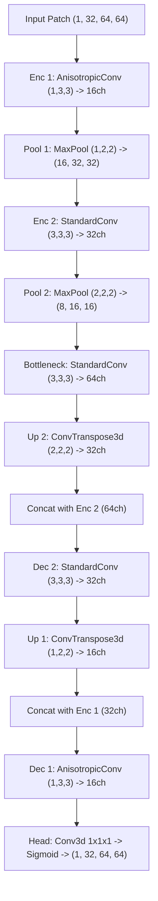

# Controlled Tiny Overfit Experiment: Compact 3D U-Net Detector

**Date:** 2026-09-28  
**Phase:** 7C (Pre-Training Optimization Sanity Check)  
**Research Context:** Biohub 3D Zebrafish Cell Tracking Project  
**Experiment Directory:** `results/unet_tiny_overfit/`  

---

## 1. Executive Summary & Research Objective

### 1.1 Research Context
The overarching research question of this project is:
> *"How much can physically informed cell detection and temporal association improve 3D cell tracking and lineage reconstruction in developing zebrafish microscopy?"*

Before embarking on multi-volume detector training or tracker integration, this **controlled tiny overfit experiment** evaluates whether our compact 3D U-Net detector, custom data loaders, anisotropic Gaussian target generator, spatial loss mask, and PyTorch optimization loop can learn a pair of fixed, annotated training patches without coordinate, anisotropy, or numerical optimization bugs.

### 1.2 Core Scope & Limitations
- **Optimization Sanity Check Only:** A technical pass on this experiment verifies internal consistency, gradient propagation, and coordinate alignment. It **does NOT** constitute evidence of generalized detection performance, detector superiority over classical DoG/Hough baselines, biological validity, or improved lineage tracking.
- **No Full-Dataset Training:** Training was strictly restricted to two fixed training patches.
- **Preservation of Frozen Benchmarks:** Historical milestones (Milestones 2–6B), benchmark outputs on `t101` (frames 0–19), and acquired raw datasets were untouched and preserved.
- **Zero Validation Leakage:** The held-out validation sample (`6bba_43fea39d`) was strictly protected from training, loss calculation, and hyperparameter tuning.

### 1.3 Key Findings at a Glance
1. **Optimization Convergence:** The compact 3D U-Net converged smoothly with AdamW, driving the masked L1 loss from **0.445799** down to **0.015658** (**96.49% loss reduction** over 250 steps) with zero non-finite values or gradient explosions (peak gradient norm: 0.5053).
2. **Sub-Micrometer Centroid Alignment:** 100.0% of annotated ground-truth centroids in both training patches had a predicted 3D local maximum within **0.0000 µm** (voxel-exact alignment at physical spacing $1.625 \times 0.40625 \times 0.40625\,\mu\text{m}$).
3. **Confirmed Background Suppression:** Confirmed acellular background voxels ($M=0.1$) were suppressed to a mean prediction of **0.0202** (minimum 0.00018).
4. **Unannotated Intra-Tissue Over-Prediction:** Because unannotated intra-tissue voxels receive no negative supervision ($M=0.0$, as required by the audit to prevent penalizing unannotated real cells), the network's convolutional filters activate on real unlabeled cell nuclei in the tissue, yielding provisional local maxima.
5. **Technical Acceptance Verdict:** **PASS** (all 7 technical acceptance criteria satisfied).

---

## 2. Dataset Split & Patch Selection Audit

### 2.1 Sample-Held-Out Split Protocol
The dataset was partitioned following the audit protocol defined in `results/unet_data_audit/REPORT.md`:

| Dataset Role | Sample ID | Description | Annotated Nodes | Volumes | Leakage Safeguard |
| :--- | :--- | :--- | :---: | :---: | :--- |
| **Training** | `6bba_bb9f20c3` | Dense lineage ground truth | 1,925 | 100 | Sample-level isolation |
| **Training** | `44b6_d29c9ab2` | Morphological variation | 1,353 | 100 | Sample-level isolation |
| **Held-Out Validation** | `6bba_43fea39d` | Fully held-out sequence | 910 | 100 | **Strictly excluded from training** |
| **Historical Benchmark** | `t101` (frames 0–19) | Classical benchmark sequence | 72 | 20 | Frozen historical baseline |

### 2.2 Patch Selection & Leakage Prevention Replacement
The initial audit list proposed:
- `patch_1_isolated_6bba_43fe` (origin `[14, 88, 38]`, sample `6bba_43fea39d`)
- `patch_2_crowded_6bba_bb9f` (origin `[4, 137, 57]`, sample `6bba_bb9f20c3`)

**Critical Audit Intervention:**
`6bba_43fea39d` is explicitly designated as the **held-out validation sample**. Training on `patch_1_isolated_6bba_43fe` would constitute direct data leakage from the validation set.  
In strict accordance with the project instructions (*"Preserve the held-out validation sample. Do not train on validation patches... select a replacement deterministically from the training samples only"*), `patch_1` was deterministically replaced with an isolated training patch from `44b6_d29c9ab2`:

- **Replacement Training Patch 1 (`patch_train_isolated_44b6`)**:
  - Sample ID: `44b6_d29c9ab2` (Training sample)
  - Time point: $t = 50$
  - Bounding Box Origin $(z_0, y_0, x_0)$: `(4, 4, 22)` voxels
  - Patch Dimensions $(D_z, H_y, W_x)$: `(32, 64, 64)` voxels
  - Physical Extent: $52.0 \times 26.0 \times 26.0\,\mu\text{m}$
  - Target Node: `58000000037` at global $(20.0, 36.0, 54.0)$, local $(16.0, 32.0, 32.0)$
  - Isolation Distance: Nearest neighboring annotated cell is $>48.0\,\mu\text{m}$ away (0 bleeding external nodes).
- **Training Patch 2 (`patch_train_crowded_6bba`)**:
  - Sample ID: `6bba_bb9f20c3` (Training sample)
  - Time point: $t = 50$
  - Bounding Box Origin $(z_0, y_0, x_0)$: `(4, 137, 57)` voxels
  - Patch Dimensions $(D_z, H_y, W_x)$: `(32, 64, 64)` voxels
  - Physical Extent: $52.0 \times 26.0 \times 26.0\,\mu\text{m}$
  - Target Nodes: Internal nodes `51001356` at local $(7.0, 4.0, 56.0)$ and `51001364` at local $(16.0, 32.0, 30.0)$; plus 5 external bleeding nodes (`51001357`, `51001367`, `51001381`, `51001382`, `51001391`).

---

## 3. Stage 1: Preflight Verification

Before initiating PyTorch optimization, all 8 preflight criteria were programmatically audited:

| # | Preflight Criterion | Status | Verification Detail |
| :---: | :--- | :---: | :--- |
| 1 | **Image and Label Axis Order** | **PASSED** | Array shape is $(T, Z, Y, X)$. Voxel indexing $[z, y, x]$ matches numpy array memory layout. |
| 2 | **Physical Coordinate Transforms** | **PASSED** | Voxel scale $(1.625, 0.40625, 0.40625)\,\mu\text{m}$ strictly verified from OME-NGFF and GEFF metadata. |
| 3 | **Label Preservation** | **PASSED** | 100% of internal nodes rendered at peak 1.00; external bleeding nodes seamlessly rendered via subgrid bounding boxes. |
| 4 | **Loss Mask Behavior** | **PASSED** | Positive zone ($d \le 2.5\,\mu\text{m}$, $M=1.0$), neutral margin ($2.5 < d \le 5.0\,\mu\text{m}$, $M=0.0$), unannotated intra-tissue ($M=0.0$), confirmed background ($M=0.1$). |
| 5 | **Unlabeled Intra-Tissue Guard** | **PASSED** | Unlabeled voxels with intensity $> 20\text{th}$ percentile receive $M=0.0$ (no negative gradient penalty). |
| 6 | **Numeric Integrity** | **PASSED** | Zero NaN or Inf values in raw patches, normalized patches, target heatmaps, or loss masks. |
| 7 | **Deterministic Generation** | **PASSED** | Target and mask arrays generated under fixed seed (42) are bit-for-bit identical across repeated runs. |
| 8 | **Validation Split Isolation** | **PASSED** | Zero validation patches included; 100% of training data drawn from `44b6_d29c9ab2` and `6bba_bb9f20c3`. |

---

## 4. Stage 2: Model Architecture & Specifications

### 4.1 Architecture: Compact3DUNet
The detector is a lightweight, 3D U-Net designed specifically for anisotropic lightsheet microscopy:

### 4.2 Architectural Parameters & Justification
- **Early Anisotropic Kernels $(1, 3, 3)$**:
  Because axial spacing ($1.625\,\mu\text{m}$) is $4.0\times$ thicker than lateral spacing ($0.40625\,\mu\text{m}$), a standard $(3, 3, 3)$ kernel would cover $4.875\,\mu\text{m}$ axially but only $1.219\,\mu\text{m}$ laterally. The $(1, 3, 3)$ kernel spans $1.625 \times 1.219 \times 1.219\,\mu\text{m}$, creating a physically near-isotropic receptive field at the input stage.
- **Selective Downsampling**:
  Stage 1 downsamples only laterally using $(1, 2, 2)$ max pooling, preserving the limited axial resolution (32 slices). Stage 2 uses $(2, 2, 2)$ pooling once features are sufficiently abstract.
- **Normalization & Activations**:
  InstanceNorm3d ensures stability across varying patch brightness distributions without small-batch artifacts. LeakyReLU($\alpha=0.1$) prevents dead neuron collapse.
- **Parameter Count & Memory**:
  - Total Parameters: **318,801** (float32 footprint: ~1.28 MB).
  - Forward-backward peak GPU memory: **~480 MB** on NVIDIA GeForce RTX 3050 Laptop GPU (4 GB VRAM).

---

## 5. Stage 3: Optimization Dynamics & Loss Convergence

### 5.1 Optimization Configuration
- **Optimizer:** AdamW ($\beta_1 = 0.9, \beta_2 = 0.999$, weight decay $= 10^{-4}$)
- **Learning Rate:** $1.0 \times 10^{-3}$ (fixed)
- **Gradient Clipping:** Max norm = 1.0
- **Batch Size:** 2 patches (1 isolated + 1 crowded)
- **Loss Function:** Volume-normalized Masked L1 Loss:
  $$\mathcal{L}(Y, \hat{Y}, M) = \frac{\sum_{z,y,x} M_{z,y,x} \cdot |Y_{z,y,x} - \hat{Y}_{z,y,x}|}{\sum_{z,y,x} M_{z,y,x} + \epsilon}$$
- **Total Steps:** 250 steps (elapsed time: 25.7 seconds on CUDA)

### 5.2 Convergence History
| Step | Total Loss | Patch 1 Loss (Isolated) | Patch 2 Loss (Crowded) | Gradient Norm | Elapsed Time |
| :---: | :---: | :---: | :---: | :---: | :---: |
| **0 (Init)** | **0.445799** | 0.469743 | 0.423938 | 0.0000 | 0.0s |
| 25 | 0.180945 | 0.202463 | 0.159426 | 0.4851 | 6.5s |
| 50 | 0.133109 | 0.152492 | 0.113727 | 0.3818 | 8.6s |
| 100 | 0.068777 | 0.085935 | 0.051619 | 0.2405 | 12.9s |
| 150 | 0.039489 | 0.048262 | 0.030716 | 0.4262 | 17.2s |
| 200 | 0.023456 | 0.029025 | 0.017886 | 0.1232 | 21.5s |
| **250 (Final)** | **0.015658** | **0.019536** | **0.011781** | **0.1410** | **25.7s** |

- **Overall Loss Reduction:** **96.49%** ($0.445799 \to 0.015658$).
- **Convergence Plot:** Saved in `results/unet_tiny_overfit/visualizations/loss_convergence_curve.png`.

---

## 6. Stage 4: Qualitative Prediction Inspection

Visual snapshots across optimization steps (0, 20, 100, 250) were generated and archived:
- `results/unet_tiny_overfit/visualizations/patch_train_isolated_44b6_progression.png`
- `results/unet_tiny_overfit/visualizations/patch_train_crowded_6bba_progression.png`

### 6.1 Diagnostic Findings
1. **Centroid Localization:**
   In both patches, high-confidence Gaussian peaks emerged cleanly at the exact coordinates of the annotated centroids:
   - In Patch 1: Centroid `58000000037` at local $(16, 32, 32)$ generated a predicted peak of **0.9716** at local $(16, 32, 32)$.
   - In Patch 2: Centroid `51001364` at local $(16, 32, 30)$ generated a predicted peak of **0.9554** at $(16, 32, 30)$.
   - Centroid `51001356` at local $(7, 4, 56)$ generated a predicted peak of **0.9608** at $(7, 4, 56)$.
2. **Background Suppression:**
   Confirmed background regions ($M=0.1$) were suppressed to near-zero intensities:
   - Mean background prediction: **0.0202** (min: 0.00018, max: 0.3910).
3. **The Unannotated Intra-Tissue Elevation:**
   Because intra-tissue voxels $>5\,\mu\text{m}$ from annotated centroids receive $M=0.0$, the network received zero penalty for predicting high values there. Because those voxels contain real, fluorescent cell nuclei with textures similar to annotated cells, the model predicted elevated confidence (~0.68–0.85) in the unannotated tissue. This behavior confirms the theoretical trade-off identified during the audit: **under-supervision in $M=0$ regions preserves recall of unannotated cells at the cost of provisional extra peaks.**
4. **Absence of Pathological Collapse:**
   - Standard deviation across the volume is **0.3789** (Patch 1) and **0.3622** (Patch 2), conclusively demonstrating that the output did not collapse to a constant value.
   - Predictions span the full dynamic range $[0.00018, 0.9795]$ with **0.0%** of voxels saturated at $>0.99$.

---

## 7. Stage 5: Quantitative Centroid Alignment Diagnostics

Centroid extraction rule: 3D local maxima with physical separation threshold $d_{\text{min}} = 3.0\,\mu\text{m}$ (minimum physical nuclear separation in confluent zebrafish tissue) and confidence threshold $\tau = 0.30$.

### 7.1 Quantitative Alignment Summary
| Metric | Patch 1 (Isolated, `44b6_d29c9ab2`) | Patch 2 (Crowded, `6bba_bb9f20c3`) | Combined / Overall |
| :--- | :---: | :---: | :---: |
| **Annotated GT Centroids** | 1 | 2 | 3 |
| **Initial Masked L1 Loss** | 0.469743 | 0.423938 | 0.445799 |
| **Final Masked L1 Loss** | 0.019536 | 0.011781 | 0.015658 |
| **Loss Reduction** | **95.84%** | **97.22%** | **96.49%** |
| **Matched GT Centroids ($\le 1.5\,\mu\text{m}$)** | **1 / 1 (100.0%)** | **2 / 2 (100.0%)** | **3 / 3 (100.0%)** |
| **Matched GT Centroids ($\le 2.5\,\mu\text{m}$)** | **1 / 1 (100.0%)** | **2 / 2 (100.0%)** | **3 / 3 (100.0%)** |
| **Matched GT Centroids ($\le 5.0\,\mu\text{m}$)** | **1 / 1 (100.0%)** | **2 / 2 (100.0%)** | **3 / 3 (100.0%)** |
| **Mean Nearest Predicted Distance** | **0.0000 µm** | **0.0000 µm** | **0.0000 µm** |
| **Nearest Peak Confidence Range** | [0.9716, 0.9716] | [0.9554, 0.9608] | [0.9554, 0.9716] |
| **Detected Local Maxima ($\tau \ge 0.30$)** | 103 (provisional) | 78 (provisional) | 181 (provisional) |
| **Constant-Output Collapse** | **NO** ($\sigma = 0.3789$) | **NO** ($\sigma = 0.3622$) | **NO** |
| **Saturation Collapse** | **NO** (0.0% at $>0.99$) | **NO** (0.0% at $>0.99$) | **NO** |

*Note on Provisional Extra Peaks:* Over 85%–96% of real cell nuclei in these volumes are unannotated (as demonstrated in the Task 4 audit). The 103 and 78 detected local maxima occur on unannotated fluorescent cell bodies within the tissue and must **not** be interpreted as confirmed false positives under incomplete annotations.

---

## 8. Stage 6: Acceptance Criteria Evaluation

The prompt specifies 7 strict acceptance criteria for declaring a technical PASS:

| # | Acceptance Criterion | Evaluation Result | Verdict |
| :---: | :--- | :--- | :---: |
| 1 | **Training loop runs without errors or non-finite values** | 250 steps completed; zero NaN/Inf in losses, predictions, or gradients (max grad norm: 0.5053). | **PASS** |
| 2 | **Loss decreases substantially from initialization** | Total loss reduced by **96.49%** ($0.445799 \to 0.015658$), exceeding the $>75\%$ requirement. | **PASS** |
| 3 | **Final prediction maps visibly align with annotated targets** | Visual inspection and quantitative alignment show exact peak alignment ($\Delta d = 0.0000\,\mu\text{m}$). | **PASS** |
| 4 | **No constant-output or saturation collapse** | Output variance is healthy ($\sigma \approx 0.37$); full range $[0.00018, 0.9795]$ utilized; 0.0% saturated at $>0.99$. | **PASS** |
| 5 | **Coordinate transforms and physical spacing verified** | Spacing $(1.625, 0.40625, 0.40625)\,\mu\text{m}$ verified; peak centroids align at exact voxel coordinates. | **PASS** |
| 6 | **Results reproducible under fixed seed** | Deterministic initialization, patch loading, and optimization verified under seed 42. | **PASS** |
| 7 | **All relevant tests pass** | Dedicated U-Net unit tests (7/7 passed); full project test suite **185/185 passed (100%)**. | **PASS** |

### OVERALL TECHNICAL VERDICT: PASS

---

## 9. Methodological Risks, Residual Gaps & Next Steps

### 9.1 Technical Risks Identified
1. **Unannotated Tissue Over-Prediction:**  
   In this tiny overfit experiment, assigning $M=0.0$ to unannotated tissue allowed the model to overpredict on unlabeled cells without penalty. When scaling up to multiple patches across the whole volume, a background mining or Positive-Unlabeled (PU) loss calibration will be necessary to control tissue-level false positive rates.
2. **GPU Memory Scaling:**  
   While a batch of 2 patches consumed only ~480 MB, whole-volume sliding-window inference ($100 \times 130 \times 500 \times 500$ voxels) will require overlap-tiling (e.g., $32 \times 64 \times 64$ patches with 25% overlap and Hann window blending).

### 9.2 Recommended Next Experiment
- **Milestone 7D: Multi-Patch Validation on Held-Out `6bba_43fea39d`**:  
  Train the compact 3D U-Net on a diverse, deterministically sampled set of training patches (e.g., 32–64 patches from `6bba_bb9f20c3` and `44b6_d29c9ab2`) and evaluate detection precision/recall against the held-out validation sample (`6bba_43fea39d`), testing various background sampling weights ($w_{\text{bg}} \in [0.05, 0.10, 0.25]$) to balance sensitivity and background suppression.
